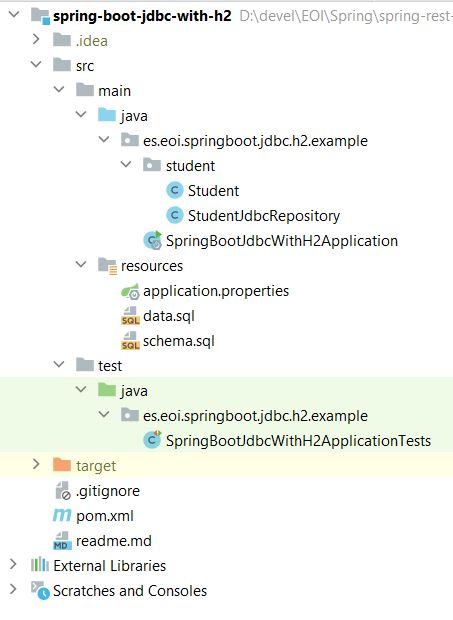

# Integrating Spring Boot and Spring JDBC with H2 and Starter JDBC

This guide will help you create a simple project with Spring Boot. You will add code to the project to connect to a database using Spring JDBC. You will learn to write all the CRUD methods.

You will learn
- How to use Spring Boot Started JDBC?
- How to connect a Spring Boot project to database using Spring JDBC?
- How to write a simple repository class with all the CRUD methods?
- How to execute basic queries using Spring JDBC?
- How to create a project using Spring Boot, Spring JDBC and H2?
- What are the basics of an in memory database?

# Project Code Structure

Following screenshot shows the structure of the project we will create.



A few details:

- Student.java - The bean to store student details.
- StudentJdbcRepository.java - Contains all the methods to store and retrieve student details to the H2 database.
- schema.sql - Since we are using an in memory database, we define the tables as part of our application code in this file.
- data.sql - We use data.sql to populate the initial student data.
- SpringBootJdbcWithH2Application.java - The main Spring Boot Application class which is used to launch up the application. We will extend CommandLineRunner interface and implement public void run(String... args) method to launch the spring jdbc code when the server launches up.
- pom.xml - Contains all the dependencies needed to build this project. We will use Spring Boot Starter JDBC and Web other than Developer Tools and H2 as in memory database.

Tools you will need
- Maven 3.0+ is your build tool
- Your favorite IDE. 
- JDK 1.8+

# A little bit of Theory
JDBC
- JDBC stands for Java Database Connectivity
- It used concepts like Statement, PreparedStatement and ResultSet
- In the example below, the query used is Update todo set user=?, desc=?, target_date=?, is_done=? where id=?
- The values needed to execute the query are set into the query using different set methods on the PreparedStatement
- Results from the query are populated into the ResultSet. We had to write code to liquidate the ResultSet into objects.

```java 
Connection connection = datasource.getConnection();

PreparedStatement st = connection.prepareStatement(
		"Update todo set user=?, desc=?, target_date=?, is_done=? where id=?");

st.setString(1, todo.getUser());
st.setString(2, todo.getDesc());
st.setTimestamp(3, new Timestamp(
		todo.getTargetDate().getTime()));
st.setBoolean(4, todo.isDone());
st.setInt(5, todo.getId());

st.execute();

st.close();

connection.close();
```

Spring JDBC

Spring JDBC provides a layer on top of JDBC
- It used concepts like JDBCTemplate
- Typically needs lesser number of lines compared to JDBC as following are simplified
- mapping parameters to queries
- liquidating resultsets to beans
- zero exception handling needed because all exceptions are converted to RuntimeExceptions

# Creating the Project with Spring Initializr

Creating a REST service with Spring Initializr is a cake walk. We will use Spring Web MVC as our web framework.

Spring Initializr http://start.spring.io/ is great tool to bootstrap your Spring Boot projects.

- Web 
- JDBC 
- H2 
- DevTools

## Starter Projects in pom.xml

/pom.xml
```xml
<?xml version="1.0" encoding="UTF-8"?>
<project xmlns="http://maven.apache.org/POM/4.0.0" xmlns:xsi="http://www.w3.org/2001/XMLSchema-instance"
	xsi:schemaLocation="http://maven.apache.org/POM/4.0.0 http://maven.apache.org/xsd/maven-4.0.0.xsd">
	<modelVersion>4.0.0</modelVersion>

	<groupId>es.eoi.springboot.rest.example</groupId>
	<artifactId>spring-boot-jdbc-with-h2</artifactId>
	<version>0.0.1-SNAPSHOT</version>
	<packaging>jar</packaging>

	<name>spring-boot-jdbc-with-h2</name>
	<description>Spring Boot 2, JDBC and H2 - Example Project</description>

	<parent>
		<groupId>org.springframework.boot</groupId>
		<artifactId>spring-boot-starter-parent</artifactId>
		<version>2.3.1.RELEASE</version>
		<relativePath/> <!-- lookup parent from repository -->
	</parent>

	<properties>
		<project.build.sourceEncoding>UTF-8</project.build.sourceEncoding>
		<project.reporting.outputEncoding>UTF-8</project.reporting.outputEncoding>
		<java.version>1.8</java.version>
		<maven-jar-plugin.version>3.1.1</maven-jar-plugin.version>
	</properties>

	<dependencies>
		<dependency>
			<groupId>org.springframework.boot</groupId>
			<artifactId>spring-boot-starter-jdbc</artifactId>
		</dependency>
		<dependency>
			<groupId>org.springframework.boot</groupId>
			<artifactId>spring-boot-starter-web</artifactId>
		</dependency>

		<dependency>
			<groupId>org.springframework.boot</groupId>
			<artifactId>spring-boot-devtools</artifactId>
			<scope>runtime</scope>
		</dependency>
		<dependency>
			<groupId>com.h2database</groupId>
			<artifactId>h2</artifactId>
			<scope>runtime</scope>
		</dependency>
		<dependency>
			<groupId>org.springframework.boot</groupId>
			<artifactId>spring-boot-starter-test</artifactId>
			<scope>test</scope>
		</dependency>
	</dependencies>

	<build>
		<plugins>
			<plugin>
				<groupId>org.springframework.boot</groupId>
				<artifactId>spring-boot-maven-plugin</artifactId>
			</plugin>
		</plugins>
	</build>

	<repositories>
		<repository>
			<id>spring-snapshots</id>
			<name>Spring Snapshots</name>
			<url>https://repo.spring.io/snapshot</url>
			<snapshots>
				<enabled>true</enabled>
			</snapshots>
		</repository>
		<repository>
			<id>spring-milestones</id>
			<name>Spring Milestones</name>
			<url>https://repo.spring.io/milestone</url>
			<snapshots>
				<enabled>false</enabled>
			</snapshots>
		</repository>
	</repositories>

	<pluginRepositories>
		<pluginRepository>
			<id>spring-snapshots</id>
			<name>Spring Snapshots</name>
			<url>https://repo.spring.io/snapshot</url>
			<snapshots>
				<enabled>true</enabled>
			</snapshots>
		</pluginRepository>
		<pluginRepository>
			<id>spring-milestones</id>
			<name>Spring Milestones</name>
			<url>https://repo.spring.io/milestone</url>
			<snapshots>
				<enabled>false</enabled>
			</snapshots>
		</pluginRepository>
	</pluginRepositories>


</project>
```
---

## Initialize H2 in-memory database with the schema

We will use H2 as the database.

H2 provides a web interface called H2 Console to see the data. Let’s enable h2 console in the application.properties

/src/main/resources/application.properties
```properties
# Enabling H2 Console
spring.h2.console.enabled=true
#Turn Statistics on
spring.jpa.properties.hibernate.generate_statistics=true
logging.level.org.hibernate.stat=debug
```
---

When you reload the application, you can launch up H2 Console at http://localhost:8080/h2-console.

## Create Schema using schema.sql and Data using data.sql

We will create a table called student with few simple columns. We can initialize a schema by create a schema.sql file in the resources.

/src/main/resources/schema.sql
```
create table student
(
   id integer not null,
   name varchar(255) not null,
   passport_number varchar(255) not null,
   primary key(id)
);
```
---

Let’s also populate some data into the student table.

/src/main/resources/data.sql
```
insert into student
values(10001,'Jose Francisco', 'E1234567');

insert into student
values(10002,'Maria Angeles', 'A1234568');
```


When the application reloads you would see following statements in the log indicating that the sql files are picked up
```
Executing SQL script from URL [file:/spring-boot-jdbc-with-h2/target/classes/schema.sql]
Executing SQL script from URL [file:/spring-boot-jdbc-with-h2/target/classes/data.sql]
```

## Creating Student Bean
Lets create a simple Student bean with basic student information along with getters, setters and a toString method.

## Create Repository method to Read Student information
We would want to start with creating a simple repository. To talk to the database we will use a JdbcTemplate.

```java
@Repository
public class StudentJdbcRepository {
	@Autowired
	JdbcTemplate jdbcTemplate;
```

Spring Boot Auto Configuration sees H2 in the classpath. It understands that we would want to talk to an in memory database. It auto configures a datasource and also a JdbcTemplate connecting to that datasource.

Let’s create the findById method to retrieve a student by id in StudentJdbcRepository.

```java
    public Student findById(long id) {
        return jdbcTemplate.queryForObject("select * from student where id=?", new Object[]{id},
        new BeanPropertyRowMapper<Student>(Student.class));
        }
```

Notes:

- JdbcTemplate has a number of methods to execute queries. In this example, we are using the queryForObject method.
- new Object[] { id } - We are passing id as a parameter to the query
- new BeanPropertyRowMapper<Student>(Student.class) - We are using a BeanPropertyRowMapper to map the results from ResultSet to the Student bean.

We would want to execute findById method. To keep things simple we will make the SpringBootJdbcWithH2Application class implement CommandLineRunner and implement run method to call the findById method on the repository.

/src/main/java/com/eoi/springboot/jdbc/h2/example/SpringBootJdbcWithH2Application.java

```java
@SpringBootApplication
public class SpringBoot2JdbcWithH2Application implements CommandLineRunner {

    private Logger logger = LoggerFactory.getLogger(this.getClass());

    @Autowired
    StudentJdbcRepository repository;

    public static void main(String[] args) {
        SpringApplication.run(SpringBoot2JdbcWithH2Application.class, args);
    }

    @Override
    public void run(String... args) throws Exception {

        logger.info("Student id 10001 -> {}", repository.findById(10001L));

    }
}
```

Notes:
- @Autowired StudentJdbcRepository repository; - We will autowire StudentJdbcRepository we created earlier.
- public void run(String... args) throws Exception { - Implement the run method defined in the CommandLineRunner interface. This method is executed as soon as the application is launched up.
- logger.info("Student id 10001 -> {}", repository.findById(10001L)) - Log all the information about student id 10001.

When the application reloads you will see this in the log.
```
Student id 10001 -> Student [id=10001, name=Jose Francisco, passportNumber=E1234567]
```

Congratulations on executing the first Spring JDBC method! You can see how easy it is with Spring Boot.

Let’s now add another method to retrieve details of all the students to StudentJdbcRepository.
```java
class StudentRowMapper implements RowMapper<Student> {
		@Override
		public Student mapRow(ResultSet rs, int rowNum) throws SQLException {
			Student student = new Student();
			student.setId(rs.getLong("id"));
			student.setName(rs.getString("name"));
			student.setPassportNumber(rs.getString("passport_number"));
			return student;
		}

	}

	public List<Student> findAll() {
		return jdbcTemplate.query("select * from student", new StudentRowMapper());
	}
```

Notes
- class StudentRowMapper implements RowMapper<Student> - We are defining a custom row mapper to map the result set to student bean.
- jdbcTemplate.query("select * from student", new StudentRowMapper()) - Since we want to return a list of students we use the query method in JdbcTemplate.

We can add a call to find all method in the run method of SpringBootJdbcWithH2Application.java
```java
logger.info("All users 1 -> {}", repository.findAll());
```

## Implementing Spring JDBC delete, insert and update methods
```java
public int deleteById(long id) {
		return jdbcTemplate.update("delete from student where id=?", new Object[] { id });
	}

	public int insert(Student student) {
		return jdbcTemplate.update("insert into student (id, name, passport_number) " + "values(?,  ?, ?)",
				new Object[] { student.getId(), student.getName(), student.getPassportNumber() });
	}

	public int update(Student student) {
		return jdbcTemplate.update("update student " + " set name = ?, passport_number = ? " + " where id = ?",
				new Object[] { student.getName(), student.getPassportNumber(), student.getId() });
	}
```

Notes
- These methods are relatively straight forward.
- All methods use the update method in JdbcTemplate class and set the right query and parameters.

```java
logger.info("Inserting -> {}", repository.insert(new Student(10010L, "John", "A1234657")));

logger.info("Update 10001 -> {}", repository.update(new Student(10001L, "Name-Updated", "New-Passport")));

repository.deleteById(10002L);

logger.info("All users 2 -> {}", repository.findAll());
```

Awesome ! You’ve implemented all the CRUD methods using Spring JDBC and Spring Boot.