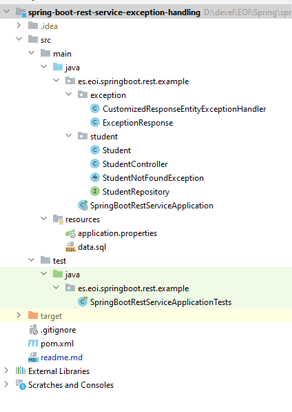
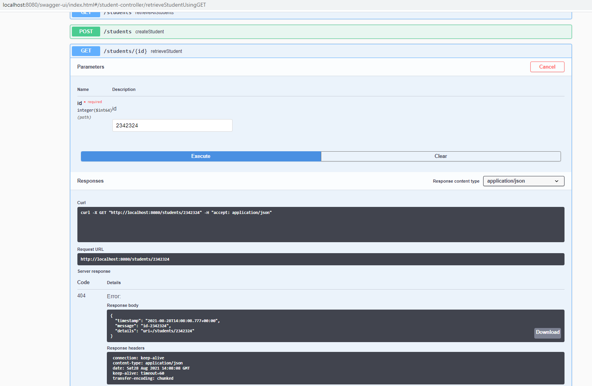

# Spring Boot Exception Handling for RESTful Services Errors

This guide will help you implement effective exception/error handling for a REST API/Service with Spring Bo

You will learn
- What is exception handling?
- Why do you need exception handling?
- What are the default exception handling capabilities provided by Spring Boot?
- How to implement exception handling with Spring Boot for RESTful Services?
- What are different return statuses you can use based on the API?
- How/What to think when you design error handling for REST API?


Following screenshot shows the structure of the project we will create.



A few details:

- SpringBoot2RestServiceApplication.java - The Spring Boot Application class generated with Spring Initializer. This class acts as the launching point for application.
- pom.xml - Contains all the dependencies needed to build this project. We will use Spring Boot Starter AOP.
- Student.java - Student JPA Entity
- StudentRepository.java - Student JPA Repository. This is created using Spring Data JpaRepository.
- StudentResource.java - Spring Rest Controller exposing all services on the student resource.
- CustomizedResponseEntityExceptionHandler.java - Component to implement global exception handling and customize the response based on the exception type.
- ErrorDetails.java - Response Bean to use when exceptions are thrown from API.
- StudentNotFoundException.java - Exception thrown from resources when student is not found.
- data.sql - Initial data for the student table. Spring Boot would execute this script after the tables are created from the entities


## What is Exception Handling?
Consider these

- What do you do when something goes wrong in your RESTful API?
- What do you do when you get an invalid request?
- What do you do when you something unexpected happens?
  Think. What should you do?

Can I just return a Page Not Found - 404? Can I return a generic message Something went wrong.. Is that good enough?

One of the core design principles for RESTful services is

So, what should you when an error or exception happens in a RESTful service?

You should return a proper error response

- Clear message indicating what went wrong and what the consumer can do to fix the error.
- Include information necessary to solve the error.
- Proper Response Status based on the context.
- Do not include sensitive information in the response.

## Response Statuses for Errors

Use appropriate status code based on the error.

- 404 - RESOURCE NOT FOUND
- 400 - BAD REQUEST
- 401 - UNAUTHORIZED
- 415 - UNSUPPORTED TYPE - Representation not supported for the resource
- 500 - SERVER ERROR

Let’s consider a few HTTP Methods:

- GET : Should not update anything. Should be idempotent (same result in multiple calls). Possible Return Codes 200 (OK) + 404 (NOT FOUND) +400 (BAD REQUEST)
- POST : Should create new resource. Ideally return JSON with link to newly created resource. Same return codes as get possible. In addition - Return code 201 (CREATED) can be used.
- PUT : Update a known resource. ex: update client details. Possible Return Codes : 200(OK) + 404 (NOT FOUND) +400 (BAD REQUEST)
- DELETE : Used to delete a resource. Possible Return Codes : 200(OK).

## What happens when you throw an Exception?

## Complete Code Example

Let’s see what Spring Boot does when an exception is thrown from a Resource.

Lets create a StudentNotFoundException.

```java
@ResponseStatus(HttpStatus.NOT_FOUND)
public class StudentNotFoundException extends RuntimeException {

	public StudentNotFoundException(String exception) {
		super(exception);
	}

}
```
---

Let’s enhance the GET method to throw this exception when a student is not found.

```java
@GetMapping("/students/{id}")
public EntityModel<Student> retrieveStudent(@PathVariable long id) {
	Optional<Student> student = studentRepository.findById(id);

	if (!student.isPresent())
		throw new StudentNotFoundException("id-" + id);

	EntityModel<Student> resource = EntityModel.of(student.get());

	WebMvcLinkBuilder linkTo = linkTo(methodOn(this.getClass()).retrieveAllStudents());

	resource.add(linkTo.withRel("all-students"));

	return resource;
}
```

This is the response when you try getting details of a non existing student http://localhost:8080/students/9.

```json
{
  "timestamp": 1512714275589,
  "status": 500,
  "error": "Internal Server Error",
  "message": "id-9",
  "path": "/students/9"
}
```

One thing I do not like is the status code of the response. It is 500 - Server Error. Actually, the error is with the request. So, I would rather return a 404 - Resource not found.

Let’s see how to customize this and more in the next section.


## Customizing Exception Handling with Spring Boot

A combination of Spring and Spring Boot provide multiple options to customize responses for errors.

### Customizing Return Status for a Specific Exception

You can specify the Response Status for a specific exception along with the definition of the Exception with ‘@ResponseStatus’ annotation.
```java
@ResponseStatus(HttpStatus.NOT_FOUND)
public class StudentNotFoundException extends RuntimeException {
```

This is the response when you try getting details of a non existing student http://localhost:8080/students/9.

```json
{
  "timestamp": 1512714594153,
  "status": 404,
  "error": "Not Found",
  "message": "id-9",
  "path": "/students/9"
}
```

## Customizing Error Response Structure

Let’s define a simple error response bean.
```java
public class ErrorDetails {
  private Date timestamp;
  private String message;
  private String details;

  public ErrorDetails(Date timestamp, String message, String details) {
    super();
    this.timestamp = timestamp;
    this.message = message;
    this.details = details;
  }
```

Let’s now define a @ControllerAdvice to handle validation errors. We do that by overriding handleMethodArgumentNotValid(MethodArgumentNotValidException ex, HttpHeaders headers, HttpStatus status, WebRequest request) method in the ResponseEntityExceptionHandler.
```java
@ControllerAdvice
@RestController
public class CustomizedResponseEntityExceptionHandler extends ResponseEntityExceptionHandler {

  @ExceptionHandler(StudentNotFoundException.class)
  public final ResponseEntity<ErrorDetails> handleUserNotFoundException(StudentNotFoundException ex, WebRequest request) {
    ErrorDetails errorDetails = new ErrorDetails(new Date(), ex.getMessage(),
        request.getDescription(false));
    return new ResponseEntity<>(errorDetails, HttpStatus.NOT_FOUND);
  }
```

Notes:

- @ExceptionHandler(StudentNotFoundException.class) indicates that this method would handle exceptions of the specific type.
- new ResponseEntity<>(errorDetails, HttpStatus.NOT_FOUND) - Create an error response object and return it with a specific Http Status.


This is the response when you try getting details of a non existing student http://localhost:8080/students/9.

```json
{
  "timestamp": 1512714887537,
  "message": "id-9",
  "details": "uri=/students/9"
}
```

Response uses the custom error structure that we had defined earlier.




## Using Error Response Structure for all Exceptions

You can further enhance CustomizedResponseEntityExceptionHandler to handle all other exceptions.
```java 
@ExceptionHandler(Exception.class)
public final ResponseEntity<ErrorDetails> handleAllExceptions(Exception ex, WebRequest request) {
  ErrorDetails errorDetails = new ErrorDetails(new Date(), ex.getMessage(),
      request.getDescription(false));
  return new ResponseEntity<>(errorDetails, HttpStatus.INTERNAL_SERVER_ERROR);
}
```


## Code


### /pom.xml

```xml
<?xml version="1.0" encoding="UTF-8"?>
<project xmlns="http://maven.apache.org/POM/4.0.0" xmlns:xsi="http://www.w3.org/2001/XMLSchema-instance"
	xsi:schemaLocation="http://maven.apache.org/POM/4.0.0 http://maven.apache.org/xsd/maven-4.0.0.xsd">
	<modelVersion>4.0.0</modelVersion>

	<groupId>es.eoi.springboot.rest.example</groupId>
	<artifactId>spring-boot-rest-service-exception-handling</artifactId>
	<version>0.0.1-SNAPSHOT</version>
	<packaging>jar</packaging>

	<name>spring-boot-rest-service</name>
	<description>Spring Boot and REST - Example Project</description>

	<parent>
		<groupId>org.springframework.boot</groupId>
		<artifactId>spring-boot-starter-parent</artifactId>
		<version>2.3.1.RELEASE</version>
		<relativePath/>
	</parent>

	<properties>
		<project.build.sourceEncoding>UTF-8</project.build.sourceEncoding>
		<project.reporting.outputEncoding>UTF-8</project.reporting.outputEncoding>
		<java.version>1.8</java.version>
		<maven-jar-plugin.version>3.1.1</maven-jar-plugin.version>
	</properties>

	<dependencies>
		<dependency>
			<groupId>org.springframework.boot</groupId>
			<artifactId>spring-boot-starter-actuator</artifactId>
		</dependency>
		<dependency>
			<groupId>org.springframework.boot</groupId>
			<artifactId>spring-boot-starter-data-jpa</artifactId>
		</dependency>
		<dependency>
			<groupId>org.springframework.boot</groupId>
			<artifactId>spring-boot-starter-web</artifactId>
		</dependency>
		<dependency>
			<groupId>org.springframework.boot</groupId>
			<artifactId>spring-boot-starter-hateoas</artifactId>
		</dependency>

		<dependency>
			<groupId>org.springframework.boot</groupId>
			<artifactId>spring-boot-devtools</artifactId>
			<scope>runtime</scope>
		</dependency>
		<dependency>
			<groupId>com.h2database</groupId>
			<artifactId>h2</artifactId>
			<scope>runtime</scope>
		</dependency>
		<dependency>
			<groupId>org.springframework.boot</groupId>
			<artifactId>spring-boot-starter-test</artifactId>
			<scope>test</scope>
		</dependency>
	</dependencies>

	<build>
		<plugins>
			<plugin>
				<groupId>org.springframework.boot</groupId>
				<artifactId>spring-boot-maven-plugin</artifactId>
			</plugin>
		</plugins>
	</build>

	<repositories>
		<repository>
			<id>spring-snapshots</id>
			<name>Spring Snapshots</name>
			<url>https://repo.spring.io/snapshot</url>
			<snapshots>
				<enabled>true</enabled>
			</snapshots>
		</repository>
		<repository>
			<id>spring-milestones</id>
			<name>Spring Milestones</name>
			<url>https://repo.spring.io/milestone</url>
			<snapshots>
				<enabled>false</enabled>
			</snapshots>
		</repository>
	</repositories>

	<pluginRepositories>
		<pluginRepository>
			<id>spring-snapshots</id>
			<name>Spring Snapshots</name>
			<url>https://repo.spring.io/snapshot</url>
			<snapshots>
				<enabled>true</enabled>
			</snapshots>
		</pluginRepository>
		<pluginRepository>
			<id>spring-milestones</id>
			<name>Spring Milestones</name>
			<url>https://repo.spring.io/milestone</url>
			<snapshots>
				<enabled>false</enabled>
			</snapshots>
		</pluginRepository>
	</pluginRepositories>


</project>
```
---
