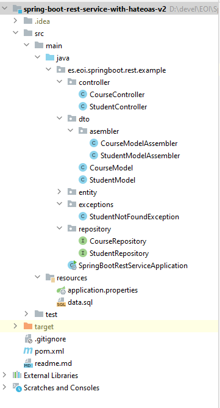

# Ejercicio Spring HATEOAS con assemblers
Spring boot, REST básico + swagger + hateoas con assemblers y relaciones con h2

Tras hacer este [tutorial guiado](https://howtodoinjava.com/spring5/hateoas/spring-hateoas-tutorial/) de HATEOAS ahora vamos a crear un CRUD de cursos y estudiantes. Usaremos lombook para facilitar el trabajo.





### /pom.xml

```xml
<?xml version="1.0" encoding="UTF-8"?>
<project xmlns="http://maven.apache.org/POM/4.0.0" xmlns:xsi="http://www.w3.org/2001/XMLSchema-instance"
         xsi:schemaLocation="http://maven.apache.org/POM/4.0.0 http://maven.apache.org/xsd/maven-4.0.0.xsd">
    <modelVersion>4.0.0</modelVersion>

    <groupId>es.eoi.springboot.rest.example</groupId>
    <artifactId>spring-boot-rest-service-hateoas</artifactId>
    <version>0.0.1-SNAPSHOT</version>
    <packaging>jar</packaging>

    <name>spring-boot-rest-service-hateoas</name>
    <description>Spring Boot and REST with Swagger and HATEOAS - Example Project</description>

    <parent>
        <groupId>org.springframework.boot</groupId>
        <artifactId>spring-boot-starter-parent</artifactId>
        <version>2.3.1.RELEASE</version>

        <relativePath/>
    </parent>

    <properties>
        <project.build.sourceEncoding>UTF-8</project.build.sourceEncoding>
        <project.reporting.outputEncoding>UTF-8</project.reporting.outputEncoding>
        <java.version>1.8</java.version>
        <maven-jar-plugin.version>3.1.1</maven-jar-plugin.version>
    </properties>

    <dependencies>
        <dependency>
            <groupId>org.springframework.boot</groupId>
            <artifactId>spring-boot-starter-actuator</artifactId>
        </dependency>
        <dependency>
            <groupId>org.springframework.boot</groupId>
            <artifactId>spring-boot-starter-data-jpa</artifactId>
        </dependency>
        <dependency>
            <groupId>org.springframework.boot</groupId>
            <artifactId>spring-boot-starter-web</artifactId>
        </dependency>
        <dependency>
            <groupId>org.springframework.boot</groupId>
            <artifactId>spring-boot-starter-hateoas</artifactId>
        </dependency>
        <dependency>
            <groupId>org.springframework.boot</groupId>
            <artifactId>spring-boot-starter-validation</artifactId>
        </dependency>
        <dependency>
            <groupId>io.springfox</groupId>
            <artifactId>springfox-boot-starter</artifactId>
            <version>3.0.0</version>
        </dependency>

        <dependency>
            <groupId>org.springframework.boot</groupId>
            <artifactId>spring-boot-devtools</artifactId>
            <scope>runtime</scope>
        </dependency>
        <dependency>
            <groupId>com.h2database</groupId>
            <artifactId>h2</artifactId>
            <scope>runtime</scope>
        </dependency>
        <dependency>
            <groupId>org.springframework.boot</groupId>
            <artifactId>spring-boot-starter-test</artifactId>
            <scope>test</scope>
        </dependency>
    </dependencies>

    <build>
        <plugins>
            <plugin>
                <groupId>org.springframework.boot</groupId>
                <artifactId>spring-boot-maven-plugin</artifactId>
            </plugin>
        </plugins>
    </build>

    <repositories>
        <repository>
            <id>spring-snapshots</id>
            <name>Spring Snapshots</name>
            <url>https://repo.spring.io/snapshot</url>
            <snapshots>
                <enabled>true</enabled>
            </snapshots>
        </repository>
        <repository>
            <id>spring-milestones</id>
            <name>Spring Milestones</name>
            <url>https://repo.spring.io/milestone</url>
            <snapshots>
                <enabled>false</enabled>
            </snapshots>
        </repository>
    </repositories>

    <pluginRepositories>
        <pluginRepository>
            <id>spring-snapshots</id>
            <name>Spring Snapshots</name>
            <url>https://repo.spring.io/snapshot</url>
            <snapshots>
                <enabled>true</enabled>
            </snapshots>
        </pluginRepository>
        <pluginRepository>
            <id>spring-milestones</id>
            <name>Spring Milestones</name>
            <url>https://repo.spring.io/milestone</url>
            <snapshots>
                <enabled>false</enabled>
            </snapshots>
        </pluginRepository>
    </pluginRepositories>
</project>
```
---

# Relaciones entre las clases entity
La relación entre cursos y estudiantes será también de M:M

```java
package es.eoi.springboot.rest.example.entity;

//...

@Data
@Builder
@AllArgsConstructor
@NoArgsConstructor
@ToString(exclude = "courses")
@Entity
public class Student implements Serializable {

    @Id
    @GeneratedValue
    private Long id;
    private String name;
    private String passportNumber;
    
    @ManyToMany(cascade=CascadeType.ALL)
    @JoinTable(
            name = "student_course",
            joinColumns = @JoinColumn(name = "student_id"),
            inverseJoinColumns = @JoinColumn(name = "course_id"))
    private List<Course> courses;

}

```
---

/src/main/java/es/eoi/springboot/rest/example/entity/Course.java
```java
package es.eoi.springboot.rest.example.entity;

//...

@Data
@Builder
@AllArgsConstructor
@NoArgsConstructor
@ToString(exclude = "students")
@Entity
public class Course {

    //...

    @ManyToMany(mappedBy = "courses", fetch = FetchType.EAGER)
    private List<Student> students;
}
```
---

# Excepciones controladas
Si no encontramos un estudiante lanzaremos una excepción `StudentNotFoundException`

# Repositorios
Extenderemos de JpaRepository al igual que en el ejemplo

# REST
Tanto para los cursos como para los estudiantes tendremos un CRUD completo.

# Initial data
Podéis utilizar estos datos como base. Podéis añadir más. 
/src/main/resources/data.sql
```

insert into student values(10001,'Jose Francisco', 'E1234567');
insert into student values(10002,'Maria Angeles', 'A1234568');

insert into course values(1001,'Programación', 'Spring');
insert into course values(1002,'Inglés I', 'Inglés básico');
insert into course values(1003,'Inglés II', 'Inglés medio');
insert into course values(1004,'Inglés II', 'Inglés avanzado');

insert into student_course values (10001, 1001);
insert into student_course values (10001, 1003);
insert into student_course values (10002, 1001);
insert into student_course values (10002, 1004);
```
---


# Assemblers

src/main/java/es/eoi/springboot/rest/example/dto/asembler/CourseModelAssembler.java
```java
package es.eoi.springboot.rest.example.dto.asembler;

import es.eoi.springboot.rest.example.controller.CourseController;
import es.eoi.springboot.rest.example.controller.StudentController;
import es.eoi.springboot.rest.example.dto.CourseModel;
import es.eoi.springboot.rest.example.dto.StudentModel;
import es.eoi.springboot.rest.example.entity.Course;
import es.eoi.springboot.rest.example.entity.Student;
import org.springframework.hateoas.server.mvc.RepresentationModelAssemblerSupport;
import org.springframework.stereotype.Component;

import java.util.Collections;
import java.util.List;
import java.util.stream.Collectors;

import static org.springframework.hateoas.server.mvc.WebMvcLinkBuilder.linkTo;
import static org.springframework.hateoas.server.mvc.WebMvcLinkBuilder.methodOn;

@Component
public class StudentModelAssembler extends RepresentationModelAssemblerSupport<Student, StudentModel> {

    public StudentModelAssembler() {
        super(StudentController.class, StudentModel.class);
    }

    @Override
    public StudentModel toModel(Student entity) {

        StudentModel studentModel = instantiateModel(entity);

        studentModel.add(linkTo(
                methodOn(StudentController.class)
                        .getStudentById(entity.getId()))
                .withSelfRel());

        studentModel.setId(entity.getId());
        studentModel.setName(entity.getName());
        studentModel.setPassportNumber(entity.getPassportNumber());

        studentModel.setCourses(toCourseModel(entity.getCourses()));
        return studentModel;
    }

    private List<CourseModel> toCourseModel(List<Course> courses) {
        if (courses.isEmpty())
            return Collections.emptyList();
        return courses.stream()
                .map(course -> CourseModel.builder()
                        .id(course.getId())
                        .name(course.getName())
                        .description(course.getDescription())
                        .build()
                        .add(linkTo(
                                methodOn(CourseController.class)
                                        .getCourseById(course.getId()))
                                .withSelfRel()))
                .collect(Collectors.toList());
    }

}
```


# Models
src/main/java/es/eoi/springboot/rest/example/dto/CourseModel.java
```java
package es.eoi.springboot.rest.example.dto;

import lombok.*;
import org.springframework.hateoas.RepresentationModel;

import javax.persistence.GeneratedValue;
import javax.persistence.Id;
import java.util.List;

@Data
@Builder
@AllArgsConstructor
@NoArgsConstructor
@EqualsAndHashCode(callSuper = false)
public class CourseModel extends RepresentationModel<CourseModel> {

	@Id
	@GeneratedValue
	private Long id;
	private String name;
	private String description;

	private List<StudentModel> students;
}

```

```java
package es.eoi.springboot.rest.example.dto;

import lombok.*;
import org.springframework.hateoas.RepresentationModel;

import javax.persistence.GeneratedValue;
import javax.persistence.Id;
import java.util.List;

@Data
@Builder
@NoArgsConstructor
@AllArgsConstructor
@EqualsAndHashCode(callSuper = false)
public class StudentModel extends RepresentationModel<StudentModel> {
	@Id
	@GeneratedValue
	private Long id;
	private String name;
	private String passportNumber;

	private List<CourseModel> courses;
}

```

# Controllers
src/main/java/es/eoi/springboot/rest/example/controller/CourseController.java
```java
package es.eoi.springboot.rest.example.controller;

import es.eoi.springboot.rest.example.dto.CourseModel;
import es.eoi.springboot.rest.example.dto.asembler.CourseModelAssembler;
import es.eoi.springboot.rest.example.entity.Course;
import es.eoi.springboot.rest.example.repository.CourseRepository;
import org.springframework.beans.factory.annotation.Autowired;
import org.springframework.hateoas.CollectionModel;
import org.springframework.http.HttpStatus;
import org.springframework.http.ResponseEntity;
import org.springframework.web.bind.annotation.*;
import org.springframework.web.servlet.support.ServletUriComponentsBuilder;

import java.net.URI;
import java.util.List;
import java.util.Optional;

@RestController
public class CourseController {

	@Autowired
	private CourseRepository courseRepository;

	@Autowired
	CourseModelAssembler courseModelAssembler;


	@GetMapping("/api/courses")
	public ResponseEntity<CollectionModel<CourseModel>> getAllCourses()
	{
		List<Course> courseEntityList = courseRepository.findAll();
		return new ResponseEntity<>(
				courseModelAssembler.toCollectionModel(courseEntityList),
				HttpStatus.OK);
	}


	@GetMapping("/api/course/{id}")
	public ResponseEntity<CourseModel> getCourseById(@PathVariable("id") Long id)
	{
		return courseRepository.findById(id)
				.map(courseModelAssembler::toModel)
				.map(ResponseEntity::ok)
				.orElse(ResponseEntity.notFound().build());
	}


	@DeleteMapping("/api/courses/{id}")
	@ResponseStatus(HttpStatus.ACCEPTED)
	public void deleteCourseApi(@PathVariable long id) {
		courseRepository.deleteById(id);
	}


	@PostMapping("/api/courses")
	public ResponseEntity<CourseModel> createCourseApi(@RequestBody Course course) {
		Course savedCourse = courseRepository.save(course);

		final URI location = ServletUriComponentsBuilder.fromCurrentRequestUri()
				.path("/{id}")
				.buildAndExpand(savedCourse.getId())
				.toUri();

		return ResponseEntity.created(location).body(courseModelAssembler.toModel(savedCourse));
	}

	@PutMapping("/api/courses/{id}")
	public ResponseEntity<CourseModel> updateCourseApi(@RequestBody Course course, @PathVariable long id) {

		Optional<Course> courseOptional = courseRepository.findById(id);

		if (!courseOptional.isPresent()) {
			return ResponseEntity.notFound().build();
		}

		course.setId(id);

		Course savedCourse = courseRepository.save(course);
		return ResponseEntity.ok().body(courseModelAssembler.toModel(savedCourse));
	}
}

```
