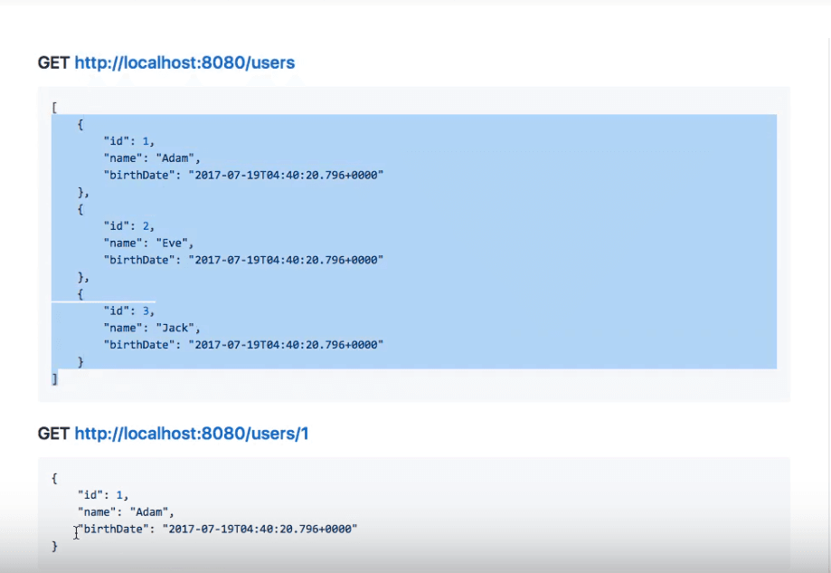
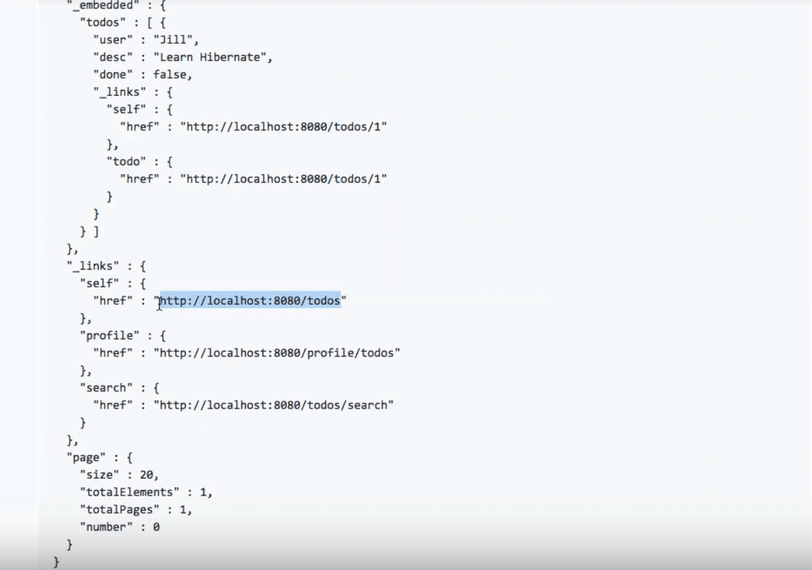
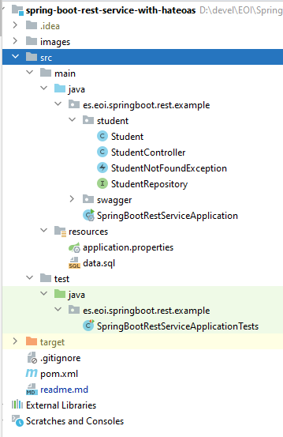
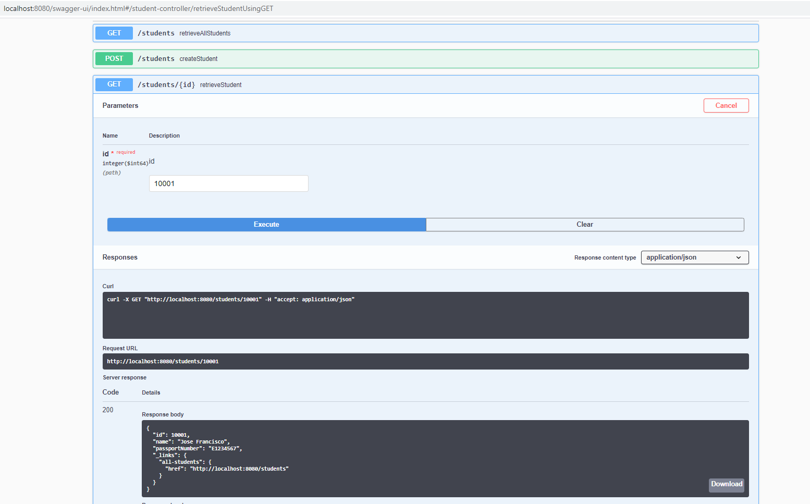

# Rest API - HATEOAS

## What is HATEOAS

While viewing a web page, you can see data in the page and perform actions with it. How about a REST API? Typically when you ask for a REST Resource, you get the details of the resource back. How about sending the operations that you can do with the resource in the response?

What will you learn?
- What is HATEOAS?
- Why do you need to use HATEOAS?
- When do you make use of HATEOAS?

## What Does HATEOAS Stand For?
The term HATEOAS stands for the phrase Hypermedia As The Engine Of Application State. To understand this further, we first need to understand the meaning of Hypermedia.

When the browser load the page, you definitely can see all the content that page has to offer. More interestingly, the page also allows you to perform a lot of actions around that data, such as:

- Clicking on buttons (the green “Clone or Download”)
- Clicking on tabs (to view the “Issues”, for instance), and several more.

Now let’s look at how our REST API’s behave:

If you look at a typical GET request to a RESTful server, such as this one:



The request to GET http://localhost:8080/users retrieves a set of three users details in this case. Sending a request with GET http://localhost:8080/users/1 will retrieve details of just the first user.

Typically, when we perform a REST request, we only get the data, and not any actions around it. This is where HATEOAS comes in the fill in the gap.

A HATEOAS request allows you to not only send the data but also specify the related actions:



This example was in the JSON format but we can return the data in XML format for example.

## Why Do We Need HATEOAS?
The single most important reason for HATEOAS is loose coupling. If a consumer of a REST service needs to hard-code all the resource URLS, then it is tightly coupled with your service implementation. Instead, if you return the URLs it could use for the actions, then it is loosely coupled. There is no tight dependency on the URI structure, as it is specified and used from the response.


## Complete Code Example



A few details:

- SpringBootRestServiceApplication.java - The Spring Boot Application class generated with Spring Initializer. This class acts as the launching point for application.
- pom.xml - Contains all the dependencies needed to build this project. We will use Spring Boot Starter AOP.
- Student.java - Student JPA Entity
- StudentRepository.java - Student JPA Repository. This is created using Spring Data JpaRepository.
- StudentController.java - Spring Rest Controller exposing all services on the student resource.
- data.sql - Initial data for the student table. Spring Boot would execute this script after the tables are created from the entities.


### /pom.xml

```xml
<?xml version="1.0" encoding="UTF-8"?>
<project xmlns="http://maven.apache.org/POM/4.0.0" xmlns:xsi="http://www.w3.org/2001/XMLSchema-instance"
         xsi:schemaLocation="http://maven.apache.org/POM/4.0.0 http://maven.apache.org/xsd/maven-4.0.0.xsd">
    <modelVersion>4.0.0</modelVersion>

    <groupId>es.eoi.springboot.rest.example</groupId>
    <artifactId>spring-boot-rest-service-hateoas</artifactId>
    <version>0.0.1-SNAPSHOT</version>
    <packaging>jar</packaging>

    <name>spring-boot-rest-service-hateoas</name>
    <description>Spring Boot and REST with Swagger and HATEOAS - Example Project</description>

    <parent>
        <groupId>org.springframework.boot</groupId>
        <artifactId>spring-boot-starter-parent</artifactId>
        <version>2.3.1.RELEASE</version>

        <relativePath/>
    </parent>

    <properties>
        <project.build.sourceEncoding>UTF-8</project.build.sourceEncoding>
        <project.reporting.outputEncoding>UTF-8</project.reporting.outputEncoding>
        <java.version>1.8</java.version>
        <maven-jar-plugin.version>3.1.1</maven-jar-plugin.version>
    </properties>

    <dependencies>
        <dependency>
            <groupId>org.springframework.boot</groupId>
            <artifactId>spring-boot-starter-actuator</artifactId>
        </dependency>
        <dependency>
            <groupId>org.springframework.boot</groupId>
            <artifactId>spring-boot-starter-data-jpa</artifactId>
        </dependency>
        <dependency>
            <groupId>org.springframework.boot</groupId>
            <artifactId>spring-boot-starter-web</artifactId>
        </dependency>
        <dependency>
            <groupId>org.springframework.boot</groupId>
            <artifactId>spring-boot-starter-hateoas</artifactId>
        </dependency>
        <dependency>
            <groupId>org.springframework.boot</groupId>
            <artifactId>spring-boot-starter-validation</artifactId>
        </dependency>
        <dependency>
            <groupId>io.springfox</groupId>
            <artifactId>springfox-boot-starter</artifactId>
            <version>3.0.0</version>
        </dependency>

        <dependency>
            <groupId>org.springframework.boot</groupId>
            <artifactId>spring-boot-devtools</artifactId>
            <scope>runtime</scope>
        </dependency>
        <dependency>
            <groupId>com.h2database</groupId>
            <artifactId>h2</artifactId>
            <scope>runtime</scope>
        </dependency>
        <dependency>
            <groupId>org.springframework.boot</groupId>
            <artifactId>spring-boot-starter-test</artifactId>
            <scope>test</scope>
        </dependency>
    </dependencies>

    <build>
        <plugins>
            <plugin>
                <groupId>org.springframework.boot</groupId>
                <artifactId>spring-boot-maven-plugin</artifactId>
            </plugin>
        </plugins>
    </build>

    <repositories>
        <repository>
            <id>spring-snapshots</id>
            <name>Spring Snapshots</name>
            <url>https://repo.spring.io/snapshot</url>
            <snapshots>
                <enabled>true</enabled>
            </snapshots>
        </repository>
        <repository>
            <id>spring-milestones</id>
            <name>Spring Milestones</name>
            <url>https://repo.spring.io/milestone</url>
            <snapshots>
                <enabled>false</enabled>
            </snapshots>
        </repository>
    </repositories>

    <pluginRepositories>
        <pluginRepository>
            <id>spring-snapshots</id>
            <name>Spring Snapshots</name>
            <url>https://repo.spring.io/snapshot</url>
            <snapshots>
                <enabled>true</enabled>
            </snapshots>
        </pluginRepository>
        <pluginRepository>
            <id>spring-milestones</id>
            <name>Spring Milestones</name>
            <url>https://repo.spring.io/milestone</url>
            <snapshots>
                <enabled>false</enabled>
            </snapshots>
        </pluginRepository>
    </pluginRepositories>


</project>


```
---

### /src/main/java/es/eoi/springboot/rest/example/SpringBoot2RestServiceApplication.java

```java
package es.eoi.springboot.rest.example;

import org.springframework.boot.SpringApplication;
import org.springframework.boot.autoconfigure.SpringBootApplication;

@SpringBootApplication
public class SpringBootRestServiceApplication {

	public static void main(String[] args) {
		SpringApplication.run(SpringBootRestServiceApplication.class, args);
	}
}
```
---

### /src/main/java/es/eoi/springboot/rest/example/student/Student.java

```java
package es.eoi.springboot.rest.example.student;

import javax.persistence.Entity;
import javax.persistence.GeneratedValue;
import javax.persistence.Id;

@Entity
public class Student {
	@Id
	@GeneratedValue
	private Long id;
	private String name;
	private String passportNumber;
	
	public Student() {
		super();
	}

	public Student(Long id, String name, String passportNumber) {
		super();
		this.id = id;
		this.name = name;
		this.passportNumber = passportNumber;
	}
	public Long getId() {
		return id;
	}
	public void setId(Long id) {
		this.id = id;
	}
	public String getName() {
		return name;
	}
	public void setName(String name) {
		this.name = name;
	}
	public String getPassportNumber() {
		return passportNumber;
	}
	public void setPassportNumber(String passportNumber) {
		this.passportNumber = passportNumber;
	}
		
}
```
---

### /src/main/java/es/eoi/springboot/rest/example/student/StudentNotFoundException.java

```java
package es.eoi.springboot.rest.example.student;

public class StudentNotFoundException extends RuntimeException {

	public StudentNotFoundException(String exception) {
		super(exception);
	}

}
```
---

### /src/main/java/es/eoi/springboot/rest/example/student/StudentRepository.java

```java
package es.eoi.springboot.rest.example.student;

import es.eoi.springboot.rest.example.student.Student;
import org.springframework.data.jpa.repository.JpaRepository;
import org.springframework.stereotype.Repository;

@Repository
public interface StudentRepository extends JpaRepository<Student, Long> {

}
```
---

### /src/main/java/es/eoi/springboot/rest/example/student/StudentController.java
To implement HATEOAS, we would need to include related resources in the response.

Instead of Student we use a return type of EntityModel<Student>.

_EntityModel is a simple class wrapping a domain object and allows adding links to it._

```java
package es.eoi.springboot.rest.example.student;

import static org.springframework.hateoas.server.mvc.WebMvcLinkBuilder.linkTo;
import static org.springframework.hateoas.server.mvc.WebMvcLinkBuilder.methodOn;

import java.net.URI;
import java.util.List;
import java.util.Optional;

import org.springframework.beans.factory.annotation.Autowired;
import org.springframework.hateoas.EntityModel;
import org.springframework.hateoas.server.mvc.WebMvcLinkBuilder;
import org.springframework.http.ResponseEntity;
import org.springframework.web.bind.annotation.DeleteMapping;
import org.springframework.web.bind.annotation.GetMapping;
import org.springframework.web.bind.annotation.PathVariable;
import org.springframework.web.bind.annotation.PostMapping;
import org.springframework.web.bind.annotation.PutMapping;
import org.springframework.web.bind.annotation.RequestBody;
import org.springframework.web.bind.annotation.RestController;
import org.springframework.web.servlet.support.ServletUriComponentsBuilder;

@RestController
public class StudentController {

    @Autowired
    private StudentRepository studentRepository;

    @GetMapping("/students")
    public List<Student> retrieveAllStudents() {
        return studentRepository.findAll();
    }

    @GetMapping("/students/{id}")
    public EntityModel<Student> retrieveStudent(@PathVariable long id) {
        Optional<Student> student = studentRepository.findById(id);

        if (!student.isPresent())
            throw new StudentNotFoundException("id-" + id);

        EntityModel<Student> resource = EntityModel.of(student.get());

        WebMvcLinkBuilder linkTo = linkTo(methodOn(this.getClass()).retrieveAllStudents());

        resource.add(linkTo.withRel("all-students"));

        return resource;
    }

    @DeleteMapping("/students/{id}")
    public void deleteStudent(@PathVariable long id) {
        studentRepository.deleteById(id);
    }

    @PostMapping("/students")
    public ResponseEntity<Object> createStudent(@RequestBody Student student) {
        Student savedStudent = studentRepository.save(student);

        URI location = ServletUriComponentsBuilder.fromCurrentRequest().path("/{id}")
                .buildAndExpand(savedStudent.getId()).toUri();

        return ResponseEntity.created(location).build();

    }

    @PutMapping("/students/{id}")
    public ResponseEntity<Object> updateStudent(@RequestBody Student student, @PathVariable long id) {

        Optional<Student> studentOptional = studentRepository.findById(id);

        if (!studentOptional.isPresent())
            return ResponseEntity.notFound().build();

        student.setId(id);

        studentRepository.save(student);

        return ResponseEntity.noContent().build();
    }
}
```
---


### /src/main/java/es/eoi/springboot/rest/example/swagger/ApiDocumentationConfig.java

```java
package es.eoi.springboot.rest.example.swagger;

import io.swagger.annotations.ExternalDocs;
import io.swagger.annotations.Info;
import io.swagger.annotations.License;
import io.swagger.annotations.SwaggerDefinition;

@SwaggerDefinition(
        info = @Info(
                description = "Awesome Resources",
                version = "V12.0.12",
                title = "Awesome Resource API",
                license = @License(
                        name = "Apache 2.0",
                        url = "http://www.apache.org/licenses/LICENSE-2.0"
                )
        ),
        consumes = {"application/json", "application/xml"},
        produces = {"application/json", "application/xml"},
        schemes = {SwaggerDefinition.Scheme.HTTP, SwaggerDefinition.Scheme.HTTPS},
        externalDocs = @ExternalDocs(value = "Read This For Sure", url = "http://mi_url.com")
)
public interface ApiDocumentationConfig {

}
```
---

### /src/main/java/es/eoi/springboot/rest/example/swagger/SwaggerConfig.java

```java
package es.eoi.springboot.rest.example.swagger;

import java.util.Arrays;
import java.util.HashSet;
import java.util.Set;

import org.springframework.context.annotation.Bean;
import org.springframework.context.annotation.Configuration;

import springfox.documentation.service.ApiInfo;
import springfox.documentation.service.Contact;
import springfox.documentation.spi.DocumentationType;
import springfox.documentation.spring.web.plugins.Docket;
import springfox.documentation.swagger2.annotations.EnableSwagger2WebMvc;

@Configuration
@EnableSwagger2WebMvc
public class SwaggerConfig {

    public static final Contact DEFAULT_CONTACT = new Contact(
            "Jose Francisco", "http://www.your_url.com", "your_email_here@host_email.com");

    public static final ApiInfo DEFAULT_API_INFO = new ApiInfo(
            "Awesome API Title", "Awesome API Description", "1.0",
            "urn:tos", DEFAULT_CONTACT,
            "Apache 2.0", "http://www.apache.org/licenses/LICENSE-2.0", Arrays.asList());

    private static final Set<String> DEFAULT_PRODUCES_AND_CONSUMES =
            new HashSet<String>(Arrays.asList("application/json", "application/xml"));

    @Bean
    public Docket api() {
        return new Docket(DocumentationType.SWAGGER_2)
                .apiInfo(DEFAULT_API_INFO)
                .produces(DEFAULT_PRODUCES_AND_CONSUMES)
                .consumes(DEFAULT_PRODUCES_AND_CONSUMES);
    }
}
```
---


### /src/main/resources/application.properties

```properties
# Enabling H2 Console
spring.h2.console.enabled=true

spring.datasource.url=jdbc:h2:mem:testdb
```
---

### /src/main/resources/data.sql

```
insert into student values(10001,'Jose Francisco', 'E1234567');

insert into student values(10002,'Maria Angeles', 'A1234568');
```
---

### /src/test/java/es/eoi/springboot/rest/example/SpringBootRestServiceApplicationTests.java

```java
package es.eoi.springboot.rest.example;

import org.junit.Test;
import org.junit.runner.RunWith;
import org.springframework.boot.test.context.SpringBootTest;
import org.springframework.test.context.junit4.SpringRunner;

@RunWith(SpringRunner.class)
@SpringBootTest
public class SpringBootRestServiceApplicationTests {

	@Test
	public void contextLoads() {
	}

}
```
---

## Check it on Swagger


